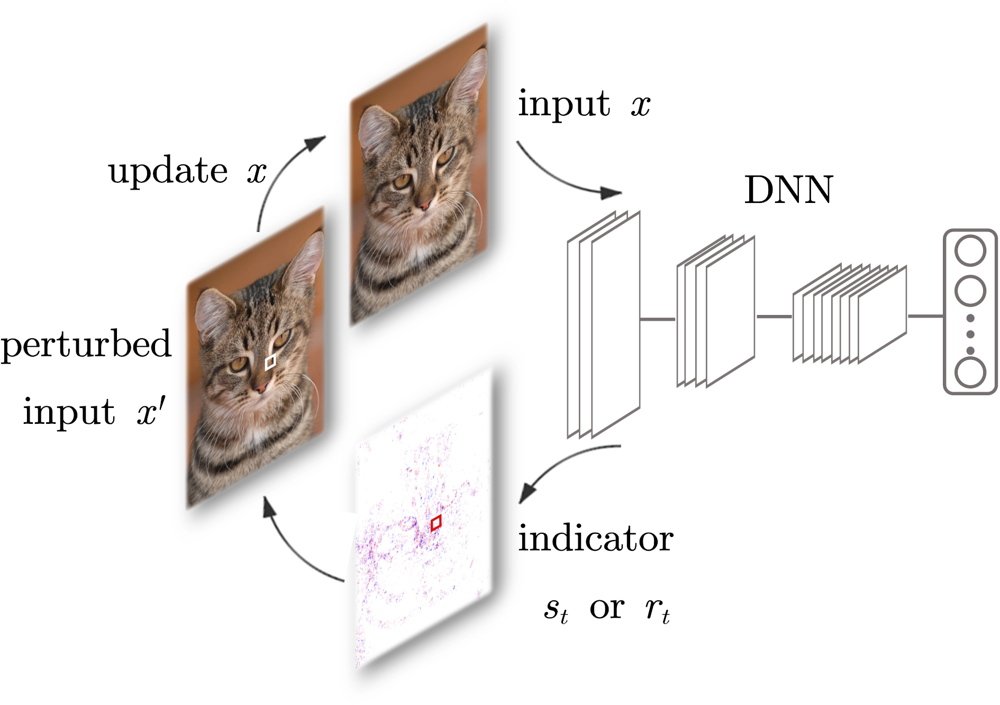
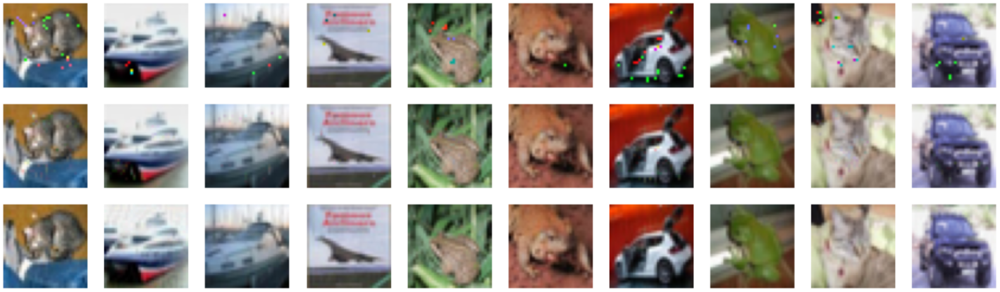
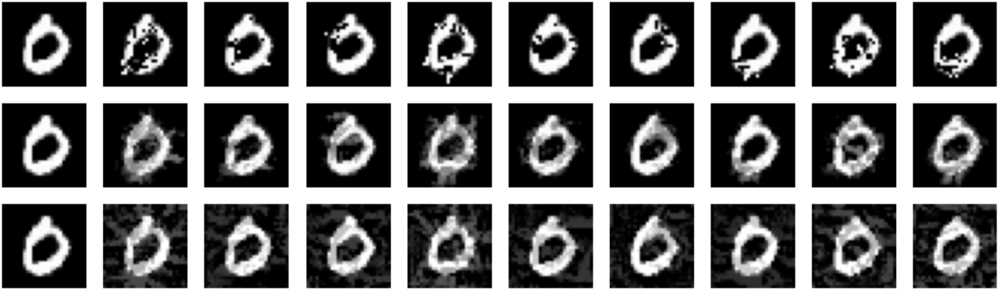
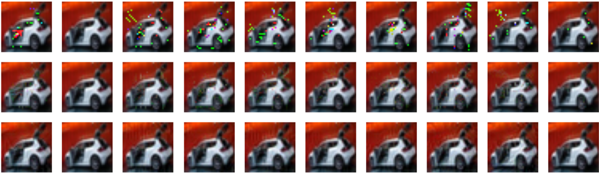

## Adversarial Attack based on Input Significance Indicator
A fast and efficient white-box iterative adversarial attack algorithm against deep learning models.
See our paper for more details:
- [Generating Adversarial Examples with Input Significance Indicator](https://doi.org/10.1016/j.neucom.2020.01.040)

## Introduction

Rather than hard predictions which a classification problem mainly concerns, the logits (non-normalized predictions before softmax function) that a classification model generates can be very helpful in analyzing the model's behavior.

Typically, by backpropagating the logits with respect to one class, we assign every input feature a score signifying its importance to the raw prediction from some perspective, which we call a 'significance indicator'.

Currently two indicators are supported, including **input sensitivity** and **input relevance**.

**Input sensitivity** measures how much changes in each feature will affect the final classification, can be derived by taking the derivative of logits with respect to each input element. 

**Input relevance** quantifies how much each feature contributes to the final classification, this is done by back-decompositing the final logits layer by layer, until each input element is assigned a relevance score, called [layer-wise relevance propagation](https://journals.plos.org/plosone/article?id=10.1371/journal.pone.0130140).

We can then iteratively find and perturb the most significant feature until the termination condition is reached, which leads to an adversarial attack aiming for the least changed input elements, in other words, an  constrained adversarial attack. 



With simple modifications, this attack can be easily extended to other norms, such as  (by perturbing multiple features at each iteration) and  (by perturbing all features with a small value according to their significance), see below some showcases of adversarial examples constrained by different norms.




One can arbitrarily choose any class's raw prediction to do backpropagation, to carry out a targeted attack.






## How to use
```
notebook/Example.ipynb
```
See this example notebook which shows how the attack works on MNIST and Cifar10, including a comparison with JSMA, can be runned in google colab.
```
create_model.py
```
Used for model definition.
```
isi_attack.py
```
Main implementation of isi attack.
```
eval.py
```
Contains functions for evaluation or visualization.

## Dependencies
- tensorflow=1.13.1
- [iNNvesitigate](https://github.com/albermax/innvestigate)(Fast implementation of significance score backpropagation)
